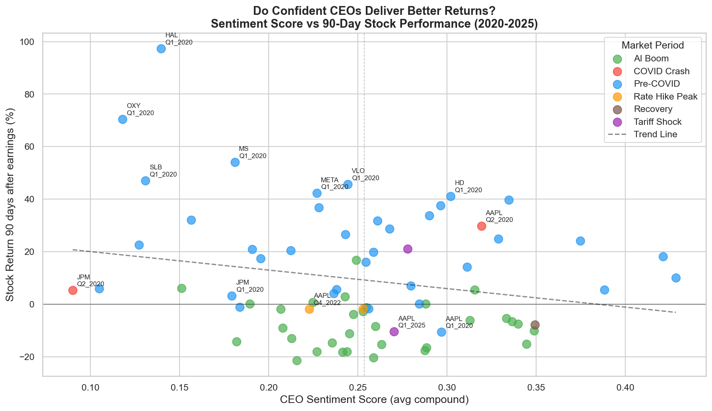
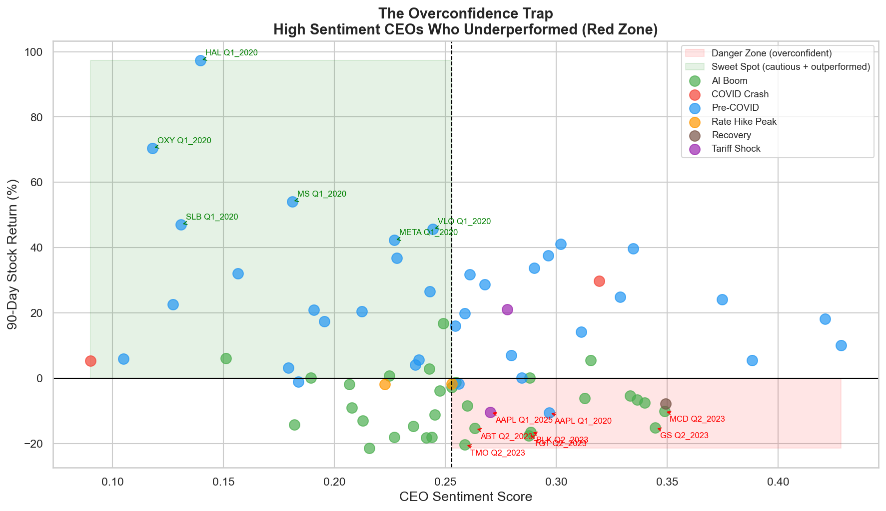
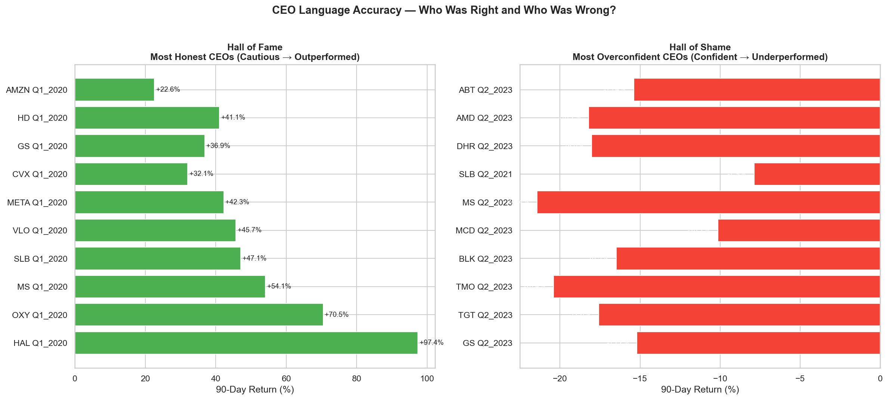

# Do CEOs Lie With Their Words?
### Earnings Call Sentiment vs. Actual Stock Performance in S&P 500 Companies (2020–2025)


---

## Research Question

Every quarter, S&P 500 CEOs get on earnings calls and talk about how their business is doing. Some are honest. Some are overconfident. Some sound great but are hiding bad news behind polished corporate language.

**Can we tell, just from the words a CEO uses, whether the stock will go up or down?**

---

## Key Findings

- **Higher CEO confidence → worse stock performance.** CEOs with the highest sentiment scores consistently underperformed the market 90 days later.
- **Cautious CEOs outperformed.** HAL Q1 2020 scored the lowest sentiment (0.14) and delivered +97.4% returns. AAPL Q1 2020 scored the highest confidence and dropped -21.83%.
- **ML model achieves 60% accuracy** predicting outperformance from CEO language alone — better than random, meaningful for financial prediction.
- **The overconfidence trap is real** — companies in the red zone (high sentiment + negative returns) cluster around the AI Boom period (Q2 2023).

---

## Visualizations

### Sentiment vs 90-Day Return


### The Overconfidence Trap


### Hall of Fame and Shame


---

## Tech Stack

| Tool | Purpose |
|---|---|
| Python | Core programming language |
| yfinance | Stock price data collection |
| NLTK / VADER | General sentiment analysis |
| FinBERT | Financial-specific NLP model |
| SQLite | Database for all research data |
| scikit-learn | Logistic regression ML model |
| Groq / Llama 3 | AI analyst report generation |
| Streamlit | Interactive web application |
| Plotly | Interactive charts |
| GitHub | Version control and portfolio |

---

## Project Structure
```
earnings-sentiment-analysis/
├── data/
│   ├── transcripts/        # 75 earnings call transcripts
│   ├── prices/             # Stock price CSVs for 50 companies
│   └── earnings_research.db # SQLite database
├── notebooks/              # 15 Jupyter notebooks
├── reports/
│   ├── charts/             # 6 research visualizations
│   └── company_reports/    # 74 AI generated analyst reports
└── app.py                  # Streamlit web application
```
---

## Database

| Table | Contents |
|---|---|
| companies | 50 S&P 500 companies across 5 sectors |
| stock_prices | 100,500 rows of daily prices (2018–2025) |
| transcripts | 75 earnings call transcripts |
| sentiment_scores | VADER scores for all transcripts |
| hedge_analysis | Hedge ratios and combined signals |
| price_analysis | 30/60/90 day returns after earnings |
| master_analysis | Everything combined |
| ml_predictions | Model predictions and probabilities |
| finbert_scores | FinBERT financial sentiment scores |

---

## Dataset Coverage

- **37 S&P 500 companies** across 5 sectors
- **75 transcripts** spanning 2020–2025
- **5 market periods:** Pre-COVID, COVID Crash, Rate Hike Peak, AI Boom, Tariff Shock
- **100,500 rows** of daily stock price data

---

## How to Run

**Clone the repo:**
```bash
git clone https://github.com/paulshekinah487-lang/earnings-sentiment-analysis.git
cd earnings-sentiment-analysis
```

**Install dependencies:**
```bash
pip install -r requirements.txt
```

**Run the app:**
```bash
streamlit run app.py
```

---

## Notebooks

| Notebook | Description |
|---|---|
| 01_stock_data_pull | Pull stock prices using yfinance |
| 02_company_list | Build S&P 500 company list |
| 03_transcripts | Transcript collection and organization |
| 04_transcript_parsing | CEO section extraction |
| 05_database_setup | SQLite database creation |
| 06_sentiment_analysis | VADER sentiment scoring |
| 07_hedge_detection | Hedge word detection |
| 08_stock_price_analysis | Return calculation |
| 09_bulk_transcript_download | Bulk data collection |
| 10_update_database | Database update |
| 11_full_analysis | Full pipeline on 75 transcripts |
| 12_visualization | Research charts |
| 13_finbert_analysis | FinBERT scoring |
| 14_ml_model | Logistic regression model |
| 15_gen_ai_reports | AI report generation |

---

## About

**Shekinah Paul**
BSc (Hons) Applied Statistics and Data Analytics
Aspiring Data Analytics professional

---

*This project was built independently as a portfolio piece demonstrating end-to-end data science skills in the finance domain.*
